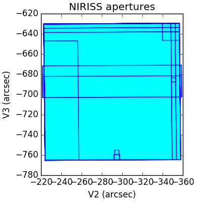
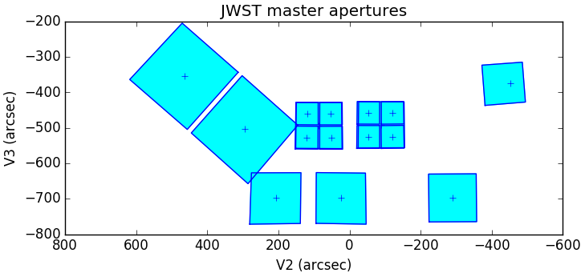
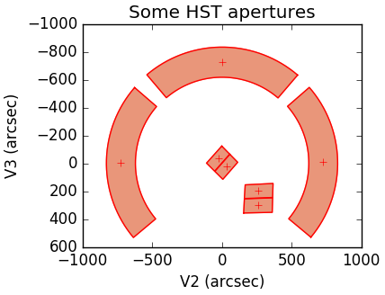

[](https://travis-ci.org/spacetelescope/pysiaf)
[](https://pysiaf.readthedocs.io/en/latest/?badge=latest)
[](https://coveralls.io/github/spacetelescope/pysiaf?branch=master)
[](https://badge.fury.io/py/pysiaf)
[](https://github.com/spacetelescope/pysiaf/blob/master/LICENSE.md)

# pysiaf
Handling of Science Instrument Aperture Files (SIAF) for space telescopes. SIAF files contain detailed geometric focal plane descriptions and relationships for the science instruments. They are maintained in the JWST/HST PRD (Project Reference Database).  
pysiaf is a python package to access, interpret, maintain, and generate SIAF, in particular for JWST. Tools for applying the frame transformations, plotting, comparison, and validation are provided.  

### Functionalities
* Captures current PRD content, i.e. pysiaf includes a copy of the SIAF XML files. These are maintained to be synchronized with the PRD.
* Transformations between the SIAF frames (Detector, Science, Ideal, Telelescope/V) are pre-loaded and easily accessible.
* Tools for plotting, validation, and comparison of SIAF apertures and files.
* Support for implementing transformations between celestial (RA, Dec) and telescope/V (V2, V3) coordinate systems is provided.
* Input/output: reading SIAF XML, writing XML/Excel/csv etc.
* Captures SI source data and code to generate the SIAF apertures
* Standard python package with installation script, unit tests, documentation.
* Supports working with HST SIAF (read-only).
 

### Example usage
Check which PRD version is in use:  
    `print(pysiaf.JWST_PRD_VERSION)`

Frame transformations (`det`, `sci`, `idl`, `tel` are supported frames):  
````
    import pysiaf
    instrument = 'NIRISS'
    
    # read SIAFXML
    siaf = pysiaf.Siaf(instrument)  
      
    # select single aperture by name
    nis_cen = siaf['NIS_CEN']  
    
    # access SIAF parameters
    print('{} V2Ref = {}'.format(nis_cen.AperName, nis_cen.V2Ref))
    print('{} V3Ref = {}'.format(nis_cen.AperName, nis_cen.V3Ref))
    
    for attribute in ['InstrName', 'AperShape']:
        print('{} {} = {}'.format(nis_cen.AperName, attribute, getattr(nis_cen, attribute)))
    
    
    # coordinates in Science frame
    sci_x = np.array([0, 2047, 2047, 0])
    sci_y = np.array([0, 0, 2047, 2047])  
    
    # transform from Science frame to Ideal frame
    idl_x, idl_y = nis_cen.sci_to_idl(sci_x, sci_y)
````    
Plotting (only a small subset of options is illustrated):  
<p align="center">
  
  
  
</p>

````
    import pylab as pl
    
    pl.figure(figsize=(4, 4), facecolor='w', edgecolor='k'); pl.clf()

    # plot single aperture
    nis_cen.plot()

    # plot all apertures in SIAF
    for aperture_name, aperture in siaf.apertures.items():
        aperture.plot()
    pl.show()
````
````
    # plot 'master' apertures
    from pysiaf.siaf import plot_master_apertures
    pl.figure(figsize=(8, 8), facecolor='w', edgecolor='k'); pl.clf()
    plot_master_apertures(mark_ref=True)
    pl.show()
````
````
    # plot HST apertures
    siaf = pysiaf.Siaf('HST')
    aperture_names = ['FGS1', 'FGS2', 'FGS3', 'IUVIS1FIX', 'IUVIS2FIX', 'JWFC1FIX', 'JWFC2FIX']

    pl.figure(figsize=(4, 4), facecolor='w', edgecolor='k')
    for aperture_name in aperture_names:
        siaf[aperture_name].plot(color='r', fill_color='darksalmon', mark_ref=True)
    ax = pl.gca()
    ax.set_aspect('equal')
    ax.invert_yaxis()
    pl.show()

````
    
### Disclaimer

All parameter values in pysiaf are subject to change. JWST values are preliminary until the JWST observatory commissioning has concluded.    

Distortion and other transformations in pysiaf are of sufficient accuracy for operations, but do not necessarily have science-grade quality. For instance, generally only one filter solution is carried per aperture.
For science-grade transformations, please consult the science pipelines and their reference files (see https://jwst-docs.stsci.edu/display/JDAT/JWST+Data+Reduction+Pipeline)     

For science observation planning, the focal plane geometry implemented in the latest APT (http://www.stsci.edu/hst/proposing/apt) takes precedence.  

The STScI Telescopes Branch provides full support of pysiaf for S&OC operational systems only.

### Documentation
The primary reference for a description of JWST SIAF is Cox & Lallo, 2017, JWST-STScI-001550: *Description and Use of the JWST Science Instrument Aperture File*, available at https://jwst.stsci.edu/documentation/technical-documents. 

pysiaf is documented at https://pysiaf.readthedocs.io/  

### Contributing
Please open a new issue or new pull request for bugs, feedback, or new features you would like to see. If there is an issue you would like to work on, please leave a comment and we will be happy to assist. New contributions and contributors are very welcome!   
 Do you have feedback and feature requests? Is there something missing you would like to see? Please open an issue or send an email to the maintainers. This package follows the Spacetelescope [Code of Conduct](CODE_OF_CONDUCT.md) strives to provide a welcoming community to all of our users and contributors. 
 
The following describes the typical work flow for contributing to the pysiaf project (adapted from JWQL):
0. Do not commit any sensitive information (e.g. STScI-internal path structures, machine names, user names, passwords, etc.) to this public repository. Git history cannot be erased.
1. Create a fork off of the `spacetelescope` `pysiaf` repository on your personal github space.
2. Make a local clone of your fork.
3. Ensure your personal fork is pointing `upstream` to https://github.com/spacetelescope/pysiaf
4. Open an issue on `spacetelescope` `pysiaf` that describes the need for and nature of the changes you plan to make. This is not necessary for minor changes and fixes. 
5. Create a branch on that personal fork.
6. Make your software changes.
7. Push that branch to your personal GitHub repository, i.e. to `origin`.
8. On the `spacetelescope` `pysiaf` repository, create a pull request that merges the branch into `spacetelescope:master`.
9. Assign a reviewer from the team for the pull request.
10. Iterate with the reviewer over any needed changes until the reviewer accepts and merges your branch.
11. Delete your local copy of your branch.


### References
The pysiaf prototype was developed on gitlab (STScI internal access only) and is kept there for reference: https://grit.stsci.edu/ins-tel/jwst_siaf_prototype

pysiaf partially recycles code from https://github.com/mperrin/jwxml


### Installation  
This package was developed in a python 3.5 environment.   

`pip install pysiaf`

Clone the repository:  
`git clone https://github.com/spacetelescope/pysiaf`  
Install pysiaf:  
`cd pysiaf`  
`python setup.py install` or  
`pip install .`
### Known installation issue

If you get an error upon  
`import pysiaf`  
that traces back to       
`import lxml.etree as ET`      
and states   
    `ImportError [...] Library not loaded: libxml2.2.dylib   
    Reason: Incompatible library version: etree.[...] requires version 12.0.0 or later,
    but libxml2.2.dylib provides version 10.0.0`,       
this can probably be fixed by downgrading the version of lxml, e.g.      
    `pip uninstall lxml`  
    `pip install lxml==3.6.4`
         
